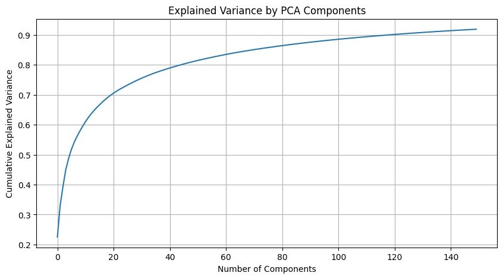
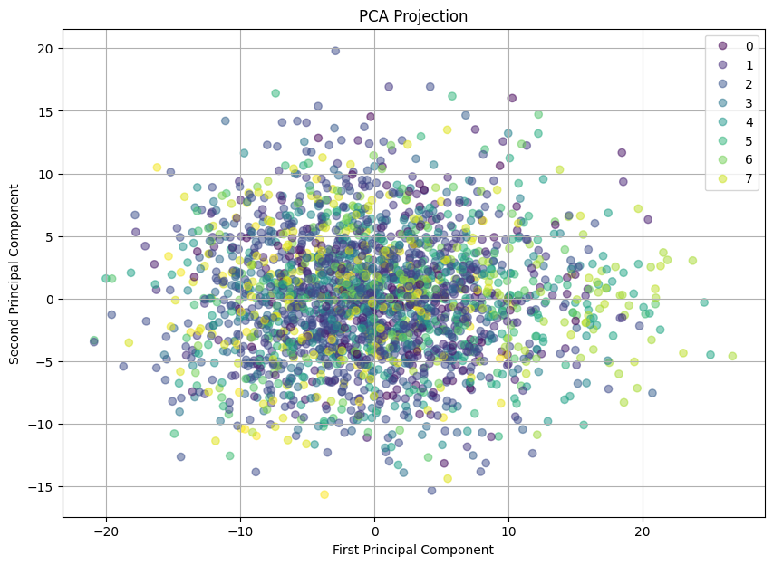
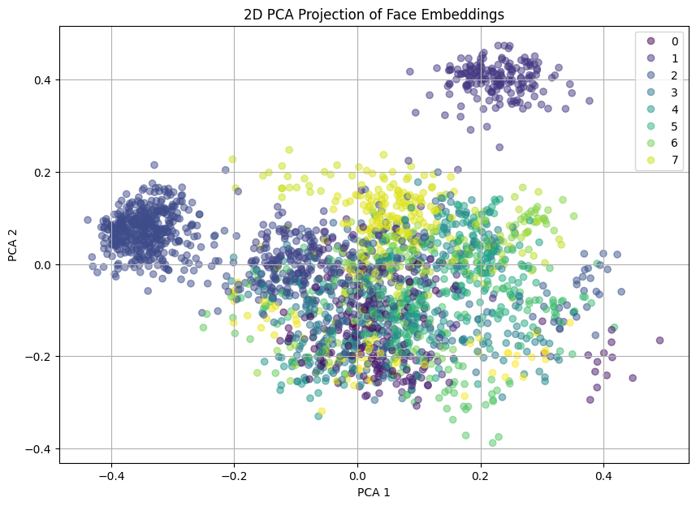
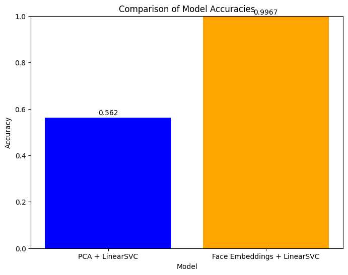

# Comparative Study of Face Recognition Techniques: Eigenfaces vs. CNN

## Overview
This project is for educational purpose .The objective of this project is to compare two different methodologies for face recognition—Eigenfaces using PCA (Principal Component Analysis) and LinearSVC (Support Vector Classifier), versus a CNN (Convolutional Neural Network)-based approach that utilizes face embeddings. The goal is to demonstrate and understand how each technique processes and classifies facial images and to evaluate their performance in terms of accuracy. This comparison not only highlights the strengths and weaknesses of classical machine learning versus deep learning models in facial recognition tasks but also provides insights into the importance of feature extraction techniques and their impact on the success of classification algorithms. The project aims to serve as an educational tool for those interested in machine learning and computer vision, as well as a practical guide for implementing and comparing these techniques.


## Getting Started

### Prerequisites
- Python 3.11.8
- Jupyter Notebook
- Required Python libraries: `matplotlib`, `numpy`, `sklearn`, `dlib`, `face_recognition`

### Installation
1. Clone the repository:
```
git clone https://github.com/MayurHulke/face-recognition-eigenfaces-vs-cnn.git
```
2. Install the required Python libraries:
```
pip install -r requirements.txt
```

### Running the Project
To initiate the comparison, open the Jupyter Notebook located in the project's root directory:
```
jupyter notebook eigenfaces-vs-cnn.ipynb
```
Follow the notebook instructions for a guided comparison of the face recognition methods.

## Methodologies

### Eigenfaces - Principal Component Analysis (PCA) + LinearSVC Approach

Utilizes Principal Component Analysis (PCA) to transform faces into a reduced set of features, known as eigenfaces. This classical approach simplifies face recognition by concentrating on the most significant features.

<div style="display: flex; justify-content: center;">
    
    
</div>


#### Implementation Highlights
- PCA with 150 components to reduce dimensionality
- Linear Support Vector Classifier (LinearSVC) for classification
- Achieved ~55% accuracy, showcasing effectiveness yet indicating room for lot of improvement

### Description
- PCA is a statistical technique used to emphasize variation and capture strong patterns in a dataset. In face recognition, it reduces the dimensionality of the data, focusing on the most important features that best represent the variance in the images.
- After PCA, a Linear Support Vector Classifier (LinearSVC) is used to classify the faces into known categories.
- By combining PCA and LinearSVC in a pipeline, the model first reduces the data to the principal components, then applies the classifier on this reduced dataset.

### Impact on Accuracy
- PCA can improve the accuracy by removing noise and redundant information, making the classifier more efficient at recognizing patterns.
- However, if PCA reduces the dimensionality too much, it might discard useful information, potentially decreasing the accuracy.

### Convolutional Neural Networks (CNN) with DLIB - Face Embeddings + LinearSVC Approach
Employs a deep learning model to generate a 128-dimensional embedding of a face, offering a more nuanced representation that enhances recognition capabilities.



### What is this Graph ?
The "2D PCA Projection of Face Embeddings" graph visually represents how face embeddings are distributed after being reduced to two dimensions using Principal Component Analysis (PCA). Here's a simple breakdown of what this graph shows:

- **Face Embeddings**: Initially, each face image is converted into a high-dimensional vector (or embedding) using a face recognition model. These embeddings capture the unique features of each face, such as the shape of the nose, the distance between the eyes, etc., in a way that similar faces have similar embeddings.

- **Dimensionality Reduction with PCA:** Since these embeddings are high-dimensional (e.g., 128 dimensions), they are hard to visualize directly. PCA is a technique that reduces the dimensionality of the data while trying to preserve as much of the variation (information) as possible. In this case, PCA reduces the embeddings from 128 dimensions down to just 2 dimensions. These two new dimensions are called the first and second principal components.

- **The Graph:**

  - Each point on the graph represents a face image, plotted according to its values in the two principal components obtained from PCA.
  - The colors of the points represent different classes, which could be different people's faces if you're working on a face recognition task. If there are multiple colors, each one corresponds to a different person.
    - **X-axis (PCA 1)** and **Y-axis (PCA 2)**: These axes represent the first and second principal components, respectively. They are the new dimensions that PCA has created. The exact meaning of these dimensions is not straightforward because they are combinations of the original 128 dimensions, but they are chosen to best separate the data in the high-dimensional space.
- **Interpreting the Graph:**
    - **Clustering:** If points of the same color (i.e., images of the same person) are closer together and separate from points of different colors, it indicates that the embeddings effectively capture the differences between faces. This is good for face recognition because it means the model can distinguish between different people.
    - **Overlap:** If there's a lot of overlap between points of different colors, it might suggest that the embeddings are not distinguishing well between different faces, which could lead to lower accuracy in face recognition tasks.

In simple terms, this graph helps us understand whether the face embeddings are good at differentiating between different people's faces based on how clustered and separated the colors are in the 2D space.

#### Implementation Highlights
- DLIB's pre-trained model for generating face embeddings
- Same LinearSVC classifier applied on the embeddings
- Significant improvement in accuracy, demonstrating deep learning's power in face recognition

### Description
- Face embeddings are a form of deep learning representation where an image is converted into a numerical vector. These vectors capture the essence of the face in a way that similar faces have similar numerical representations.
- The embeddings are then used to train a LinearSVC to classify the faces.
- This approach leverages deep learning, which is typically more powerful than PCA for capturing complex patterns.

### Impact on Accuracy
- Face embeddings can result in higher accuracy as they are designed to capture detailed and sophisticated facial features.
- The deep learning model used to generate embeddings has usually been trained on a vast array of faces, enabling it to recognize a wide range of features.

## Comparison and Analysis
The project provides a side-by-side evaluation of classical and deep learning approaches to face recognition. While the Eigenfaces method offers simplicity and decent accuracy, the CNN approach with DLIB showcases superior performance, leveraging the depth of features learned by the neural network.




## Conclusions
- The comparison shows that face embeddings combined with a LinearSVC result in significantly higher accuracy than using PCA with a LinearSVC for the face recognition task.
- The advanced feature extraction capability of deep learning models that produce face embeddings is the key contributor to this performance improvement.

# Stay Updated

If you like this project and If you're interested in more "WhiteBox" understanding projects, be sure to let me know by giving it a star ⭐ and following me on GitHub. 

**More exciting projects are on the way!**

[](https://github.com/MayurHulke/face-recognition-eigenfaces-vs-cnn)
[](https://github.com/MayurHulke)

Click [here](https://github.com/MayurHulke) to visit my profile.